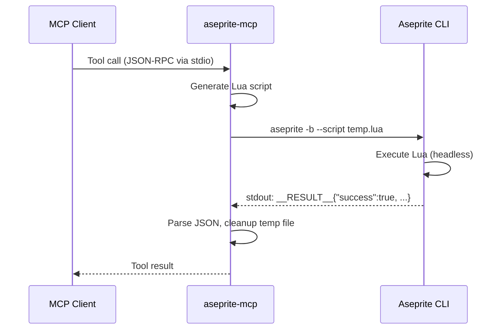
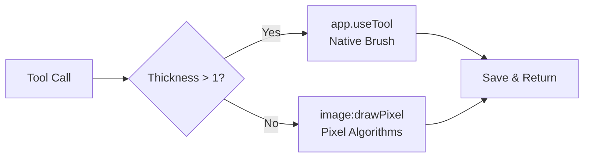

# aseprite-mcp

An [MCP](https://modelcontextprotocol.io/) server for [Aseprite](https://www.aseprite.org/) — create, edit, and export pixel art sprites, animations, and sprite sheets from any AI assistant.

<p align="center">
  
</p>

> *Drawn and animated entirely via aseprite-mcp tools — no manual pixel editing!*

## Features

- **43 tools** across 11 categories
- Native drawing with configurable brush thickness via `app.useTool()`
- Pixel-perfect algorithms (Bresenham line, midpoint circle) for thin strokes
- Cross-platform — Windows, macOS, Linux
- Secure — Lua injection prevention, sandboxed execution
- Zero runtime dependencies beyond `@modelcontextprotocol/sdk`

### Tool Overview

| Category | Tools | Examples |
|----------|-------|---------|
| **Sprites** | 6 | `create_sprite`, `resize_sprite`, `crop_sprite` |
| **Layers** | 4 | `add_layer`, `set_layer_properties`, `list_layers` |
| **Frames** | 4 | `add_frame`, `set_frame_duration`, `list_frames` |
| **Tags** | 3 | `create_tag`, `remove_tag`, `list_tags` |
| **Drawing** | 7 | `draw_rect`, `draw_circle`, `draw_line`, `draw_ellipse`, `fill_area`, `outline`, `draw_pixels` |
| **Transform** | 5 | `replace_color`, `flip_sprite`, `rotate_sprite`, `flatten_layers`, `merge_down` |
| **Palette** | 4 | `get_palette`, `set_palette_colors`, `load_palette`, `resize_palette` |
| **Cels** | 3 | `move_cel`, `set_cel_opacity`, `clear_cel` |
| **Export** | 3 | `export_sprite_sheet`, `export_frame`, `export_layers` |
| **Slices** | 2 | `create_slice`, `remove_slice` |
| **Utility** | 2 | `run_script`, `get_aseprite_version` |

> 📖 Full parameter reference: **[docs/API.md](docs/API.md)**

---

## Quick Start

### Requirements

- **Node.js** ≥ 18
- **Aseprite** ≥ 1.3 ([aseprite.org](https://www.aseprite.org/))

### Install

```bash
# npm global
npm install -g aseprite-mcp

# or from source
git clone https://github.com/ayigityol/aseprite-mcp.git
cd aseprite-mcp && npm install && npm run build
```

### Configure

<details>
<summary><strong>GitHub Copilot CLI</strong> (~/.copilot/mcp-config.json)</summary>

```json
{
  "mcpServers": {
    "aseprite": {
      "type": "local",
      "command": "node",
      "tools": ["*"],
      "args": ["/path/to/aseprite-mcp/build/index.js"],
      "env": { "ASEPRITE_PATH": "/path/to/aseprite" }
    }
  }
}
```
</details>

<details>
<summary><strong>Claude Desktop</strong> (claude_desktop_config.json)</summary>

```json
{
  "mcpServers": {
    "aseprite": {
      "command": "node",
      "args": ["/path/to/aseprite-mcp/build/index.js"],
      "env": { "ASEPRITE_PATH": "/path/to/aseprite" }
    }
  }
}
```
</details>

<details>
<summary><strong>VS Code / Cursor</strong> (.vscode/mcp.json)</summary>

```json
{
  "servers": {
    "aseprite": {
      "command": "node",
      "args": ["/path/to/aseprite-mcp/build/index.js"],
      "env": { "ASEPRITE_PATH": "/path/to/aseprite" }
    }
  }
}
```
</details>

<details>
<summary><strong>Installed globally via npm</strong></summary>

```json
{
  "mcpServers": {
    "aseprite": {
      "command": "aseprite-mcp"
    }
  }
}
```
</details>

### Environment Variables

| Variable | Description |
|----------|-------------|
| `ASEPRITE_PATH` | Path to Aseprite executable. Auto-detected if not set. |
| `DEBUG` | Set `"true"` for verbose stderr logging. |

Auto-detection searches standard install paths on all platforms, plus system PATH.

---

## Architecture





All operations run **headless** — no GUI window is opened.

---

## Docker

```bash
# Build
docker build -t aseprite-mcp .

# Run (mount your Aseprite binary + working directory)
docker run --rm -i \
  -v /path/to/aseprite:/usr/local/bin/aseprite:ro \
  -v ./sprites:/sprites \
  aseprite-mcp

# Or use Docker Compose
docker compose up
```

> Aseprite must be mounted into the container. The image packages only the MCP server.

---

## Development

```bash
npm run build       # Compile TypeScript
npm run watch       # Recompile on changes
npm test            # Run 74 unit tests (vitest)
npm run test:watch  # Watch mode
npm run inspector   # MCP Inspector for interactive testing
```

---

## Security

- **`luaEscape()`** — prevents Lua injection by escaping `\`, `"`, `\n`, `\r`
- **`luaPath()`** — normalizes and escapes file paths
- **`execFile()`** — argument arrays, no shell interpolation
- **`pcall()` wrapping** — all generated Lua scripts have error handlers
- **Local only** — no data sent to external services

---

## Troubleshooting

| Problem | Solution |
|---------|----------|
| "Aseprite executable not found" | Set `ASEPRITE_PATH` env var to the full path |
| Tool returns Aseprite error | Set `DEBUG=true` to see stderr output |
| "Layer not found" / "Tag not found" | Names are case-sensitive — use `list_layers` or `list_tags` first |
| Sprite won't save | Ensure the output directory exists |

---

## License

MIT
